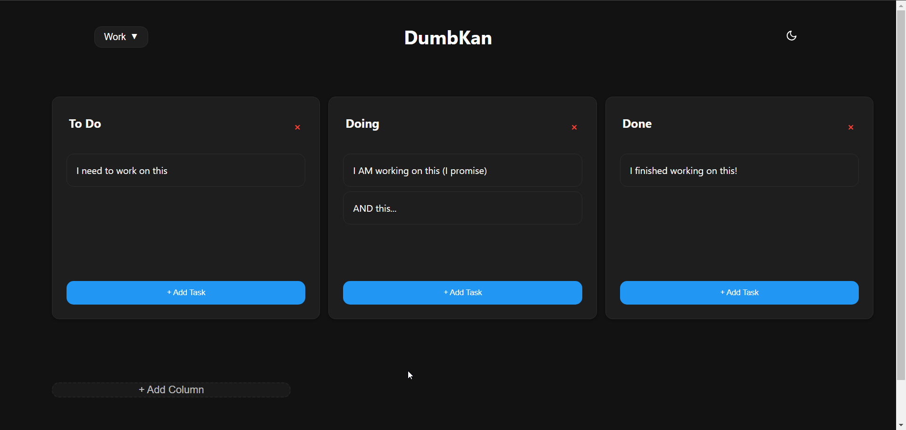

<!--
Ohart ongi: README hau automatikoki sortu da <https://github.com/YunoHost/apps/tree/master/tools/readme_generator>ri esker
EZ editatu eskuz.
-->

# DumbKan YunoHost-erako

[](https://ci-apps.yunohost.org/ci/apps/dumbkan/)


[](https://install-app.yunohost.org/?app=dumbkan)

*[Irakurri README hau beste hizkuntzatan.](./ALL_README.md)*

> *Pakete honek DumbKan YunoHost zerbitzari batean azkar eta zailtasunik gabe instalatzea ahalbidetzen dizu.*  
> *YunoHost ez baduzu, kontsultatu [gida](https://yunohost.org/install) nola instalatu ikasteko.*

## Aurreikuspena

A lightweight, mobile-friendly Kanban board application for managing tasks and projects. Built with vanilla JavaScript and Node.js.


**Paketatutako bertsioa:** 1.0.0~ynh1

## Pantaila-argazkiak



## Dokumentazioa eta baliabideak

- Aplikazioaren webgune ofiziala: <https://www.dumbware.io/>
- Jatorrizko aplikazioaren kode-gordailua: <https://github.com/DumbWareio/DumbPad>
- YunoHost Denda: <https://apps.yunohost.org/app/dumbkan>
- Eman errore baten berri: <https://github.com/YunoHost-Apps/dumbkan_ynh/issues>

## Garatzaileentzako informazioa

Bidali `pull request`a [`testing` abarrera](https://github.com/YunoHost-Apps/dumbkan_ynh/tree/testing).

`testing` abarra probatzeko, ondorengoa egin:

```bash
sudo yunohost app install https://github.com/YunoHost-Apps/dumbkan_ynh/tree/testing --debug
edo
sudo yunohost app upgrade dumbkan -u https://github.com/YunoHost-Apps/dumbkan_ynh/tree/testing --debug
```

**Informazio gehiago aplikazioaren paketatzeari buruz:** <https://yunohost.org/packaging_apps>
